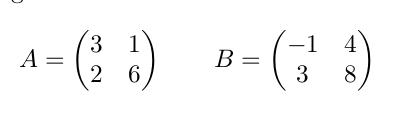
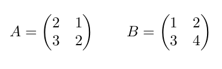
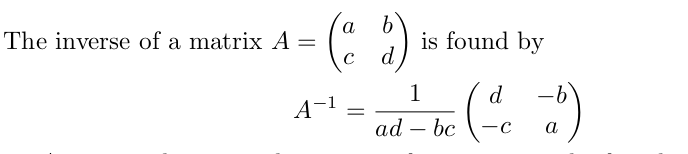
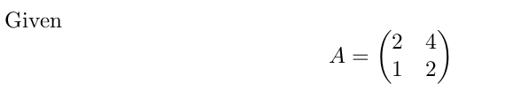
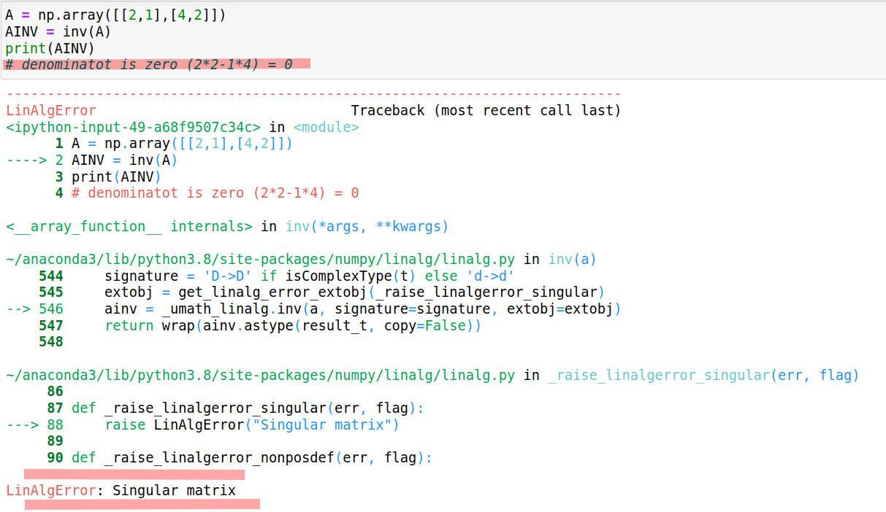
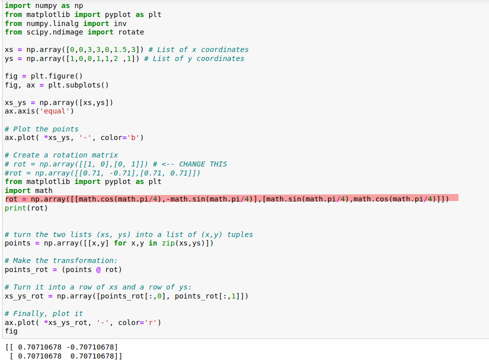
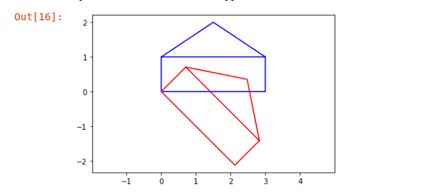

# Matrix fun

## Task 1

***
### a and b) 

**Find A^T and B^T****

A = np.array([[3,2],[1,6]])

B = np.array([[-1,3],[4,8]])

At = A.transpose()

Bt = B.transpose()

**Result:**

At = [[3 1][2 6]]

Bt = [[-1  4][ 3  8]]
***
### c) 

**Find AB (matrix multiplication). Compare with simple multiplication (using * instead of @ in Python). Can you see what is the difference?**

Simple Multiplication:

AB_S = A * B

Matrix Multiplication:

AB_M = A@B

**Result:**

AB_S = [[-3,6],[4,48]]

AB_M = [[5,25],[23,51]]
***
### d)

**Find AB^T**

ABT = AB_M.transpose()

**Result:**

ABT = [[ 5, 23],[25, 51]]
***
### e)

**Compare AB^T and B^T and A^T**

**Result:**

AB^T = [[ 5 23][25 51]]

A^T= [[3 1][2 6]]

B^T= [[-1  4][ 3  8]]
***
### f)

**Find (A^T)^T**

ATT = A.transpose().transpose()

**Result:**

ATT = [[3 2][1 6]]

***
### g)

**Find AA^T**

AAT = A@A.transpose()

**Result:**

AAT = [[13 15][15 37]]
***
## Task 2

### a and b)

**Find AB**

A = np.array([[2,3],[1,3]])

B = np.array([[3,2],[3,4]])

AB = A@B

BA = B@A

**Results:**

AB = [[15 16][12 14]]

BA = [[ 8 15][10 21]]

*** 

## Task 3

A = np.array([[2,3],[1,3]])

B = np.array([[3,2],[3,4]])
***
### a)

**Find A-1**

AINV = inv(A)

AINV = [[ 1. -1.][-0.33333333  0.66666667]]
***
### b)

**Find B-1**

BINV = inv(B)

BINV = [[ 0.66666667 -0.33333333][-0.5 0.5]]
***
### c)

**Find AA −1 . Look closely at the result.**

AINV = inv(A)

AAINV = A @ AINV

**Result:**

AAINV = [[1. 0.][0. 1.]]

***

### d)

**Find A −1 A. Look closely at the result.**

AINV = inv(A)

AINFA = AINV @ A

**Result:**

AINVA = [[1. 0.][0. 1.]]
***
### e)

**Find BB −1 . Look closely at the result.**

BINV = inv(B)

BBINV = BINV @ B

**Result:**

BBINV = [[1. 0.][0. 1.]]

***
### f)

**Find B −1 B. Do you start to see a pattern?**

BINV = inv(B)

BINFB = BINV @ B

**Result:**

BINFB = [[1. 0.][0. 1.]]

***

## Task 4

### a) Find A −1

***

## Task 5

**Plotting (lines, graphs, coordinates, etc) can be done using matplotlib. Try the following:**

### a)

**(a) Set the rotation matrix (line 18) to rotate the shape 45 degrees ( π 4 radians).**

